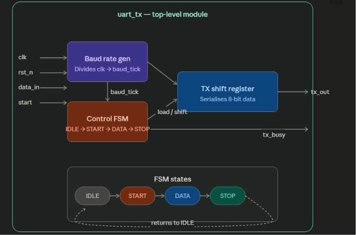

# Verilog-Based UART Transmitter with Configurable Baud Rate Generator

## About the Project

This project is a UART (Universal Asynchronous Receiver-Transmitter) 8N1 Transmitter designed using Verilog HDL. It was developed to understand how serial communication works at the hardware level.

The design uses a Finite State Machine (FSM) along with a baud rate generator to transmit 8-bit parallel data serially. A self-checking testbench was also written to verify the functionality using different test cases.
## Block Diagram



---

## Features

- UART 8N1 transmission
- Parameterized baud rate generator
- 4-State FSM implementation
- LSB-first data transmission
- Synthesizable Verilog code
- Self-checking testbench
- Compatible with EDA Playground and Icarus Verilog

---

## Project Files

```
.
├── baud_gen.v        // Generates baud tick
├── uart_tx.v         // UART transmitter
├── tb_uart_tx.v      // Testbench
└── README.md
```

---

## How it Works

The project consists of two main modules.

### 1. Baud Rate Generator

The baud rate generator divides the input clock and generates a `baud_tick` signal after a fixed number of clock cycles. The UART transmitter sends one bit whenever this tick is generated.

### 2. UART Transmitter

The transmitter uses a four-state FSM.

```
IDLE
   ↓
START
   ↓
DATA
   ↓
STOP
   ↓
IDLE
```

- **IDLE** – Waits for the `start` signal.
- **START** – Sends the start bit (`0`).
- **DATA** – Sends the 8-bit data one bit at a time (LSB first).
- **STOP** – Sends the stop bit (`1`) and returns to the IDLE state.

---

## UART Frame Format

```
Idle | Start | D0 D1 D2 D3 D4 D5 D6 D7 | Stop
  1      0      LSB -------------> MSB     1
```

---

## Test Cases Used

The following data patterns were tested.

| Input |
|--------|
| 0x41 |
| 0xFF |
| 0x00 |
| 0x55 |
| 0xAA |
| 0x5A |

All test cases were successfully transmitted and verified by the self-checking testbench.

---

## Simulation

The project was simulated using **EDA Playground** with **Icarus Verilog**, and the waveforms were viewed using **EPWave**.

Signals observed during simulation:

- clk
- rst_n
- start
- data_in
- baud_tick
- state
- bit_cnt
- shift_reg
- tx_busy
- tx_out
### Simulation Waveform


---

## What I Learned

While working on this project, I gained a better understanding of:

- UART communication protocol
- Finite State Machine (FSM) design
- Clock division using counters
- Shift registers
- Parameterized Verilog modules
- Writing self-checking testbenches
- RTL simulation and waveform analysis

---

## Tools Used

- Verilog HDL
- EDA Playground
- Icarus Verilog
- EPWave

---

## Future Improvements

Some features that can be added in the future are:

- UART Receiver (RX)
- Parity bit support
- Configurable stop bits
- FIFO buffer
- Transmit interrupt signal

---

## Author

*kura karthik*
Vardhaman College of Engineering
B.Tech Electronics and Communication Engineering
